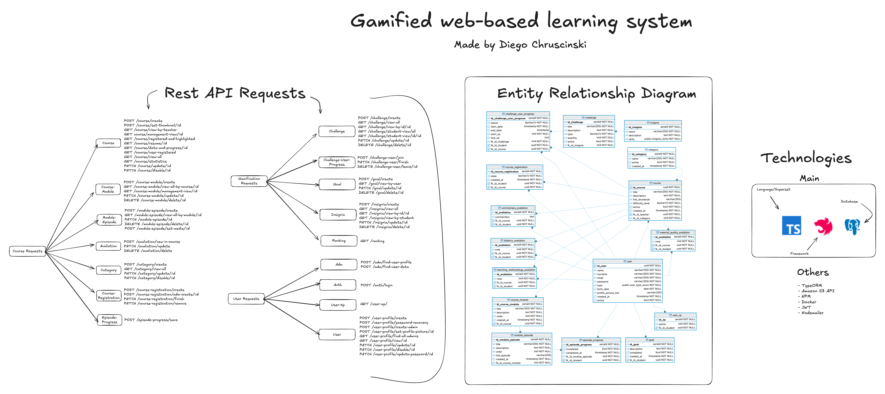

# 🎮 Gamified Web-based Learning System — Backend (NestJS)

Backend for my undergraduate capstone project (TCC): a web-based learning platform with **gamification**, built to increase engagement and improve student progress tracking through **XP**, **challenges**, **goals**, **badges**, and **ranking**. This work was approved by the evaluation committee with an average score of **9.9/10**.

**Author:** Diego Chruscinski  
**Repository:** https://github.com/chruscinskiDiego/gamified-web-education-system-server

---

## 👀 Overview (API + ERD + Technologies)

<p align="center">
  
</p>

This project exposes a **REST API** for an educational platform focused on **student progression and motivation**:

- Management of **courses**, **modules**, and **lessons/episodes**
- **Enrollment** and **progress tracking**
- **Gamification** module (XP, goals, challenges, badges, and ranking)
- **Authentication** and user management (profile, XP, permissions)

---

## ⭐ Context & value (for recruiters)

Learning platforms often struggle with **low retention** and lack of study consistency.  
This backend was designed to support **gamification mechanics** that:

- encourage consistency (goals and challenges),
- make progress visible (XP + per-lesson tracking),
- boost motivation (badges and ranking),
- enable course insights (evaluations and metrics).

The project also demonstrates important backend practices: **modular architecture**, **JWT security**, **PostgreSQL persistence**, and optional integrations (S3 and email).

---

## ✅ Key features

### 📚 Content
- **Courses:** create, list, update, plus role-based views (e.g., teacher)
- **Modules & Lessons:** structured learning paths and per-lesson progress tracking

### 🧪 Evaluations
- Structure for content evaluations and course statistics tracking

### 🕹️ Gamification
- **User XP**
- **Challenges** and challenge progress
- **Goals**
- **Badges**
- **Ranking**

### 🔐 Users & authentication
- Login and user/profile endpoints
- Structure for administrative routes (when applicable)

---

## 🧰 Tech stack

### Core
- **TypeScript**
- **NestJS**
- **PostgreSQL**

### Additional
- **TypeORM**
- **JWT**
- **Docker / Docker Compose**
- **Nodemailer** (email sending when configured)
- Storage integration compatible with **Amazon S3 API** (optional)

---

## 🚀 Install & run (Node.js and Docker are required)

```bash
# 1) Clone and enter the project
git clone https://github.com/chruscinskiDiego/gamified-web-education-system-server
cd gamified-web-education-system-server

# 2) Install dependencies
npm install

# 3) Start Postgres (Docker Compose)
docker compose up -d

# 4) Create .env (edit the VALUE placeholders afterwards)
cat > .env << 'EOF'
# =========================
# APP
# =========================
PORT=3000
NODE_ENV=development

# =========================
# POSTGRES SETTINGS (Docker)
# =========================
DB_HOST=localhost
DB_PORT=5432
DB_DATABASE=VALUE
DB_USERNAME=VALUE
DB_PASSWORD=VALUE

# (Optional: if your project uses these compose variables)
DB_COMPOSE_PORTS=VALUE
DB_COMPOSE_POSTGRES_USER=VALUE
DB_COMPOSE_POSTGRES_PASSWORD=VALUE
DB_COMPOSE_POSTGRES_DB=VALUE

# =========================
# JWT SETTINGS
# =========================
JWT_SECRET=VALUE
JWT_TOKEN_AUDIENCE=VALUE
JWT_TOKEN_ISSUER=VALUE
JWT_TOKEN_EXPIRATION=3600

# =========================
# AWS S3 SETTINGS (OPTIONAL)
# =========================
AWS_REGION=sa-east-1
AWS_ACCESS_KEY_ID=VALUE
AWS_SECRET_ACCESS_KEY=VALUE
S3_BUCKET_NAME=VALUE

# =========================
# EMAIL SETTINGS (OPTIONAL)
# =========================
SMTP_HOST=VALUE
SMTP_PORT=VALUE
SMTP_SECURE=false
SMTP_USER=VALUE
SMTP_PASS=VALUE
MAIL_FROM=VALUE
EOF

# 5) Run the API (development)
npm run start:dev
